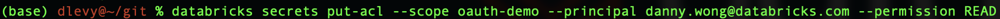

# OAuth vs Unity Catalog access for ADLS

The goal of this repository is to show the difference between using OAuth to access ADLS files vs Unity Catalog (UC) with Managed Identities.

## Getting Started

Before you get started, you will need the following for OAuth and UC respectively:

### OAuth Requirements

Please record all details below, except the keys in the secret scope (you just need the key)

1. An App Registration
2. A storage account with container (LRS, with "hierarchical namespace")
3. Grant "Storage Account Contributor" to the app registration on the container for the demo.
2. A secret scope
3. The following keys in your secret scope from the app registration:
    1. directoryId
    2. applicationId
    3. keyValue

The following shows the commands to run to set up and insert keys into a scope named, "oauth-demo"

### Important: OAuth User access is managed via ACLs to the secret scope

Users who are granted READ access, such as granting it to my colleague below, provide this as a mechanism to access via the app registration.

### Unity Catalog Requirements

For Unity Catalog Access, we require the following.

1. A Managed Identity

Create a managed identity: Follow the steps here: https://learn.microsoft.com/en-us/azure/databricks/data-governance/unity-catalog/azure-managed-identities

2. A Unity Catalog Enabled Workspace

Unity Catalog should be the base for any new workspaces. The key step is to assign a metastore to the workspace.

3. Add the Managed Identity to the Workskpace